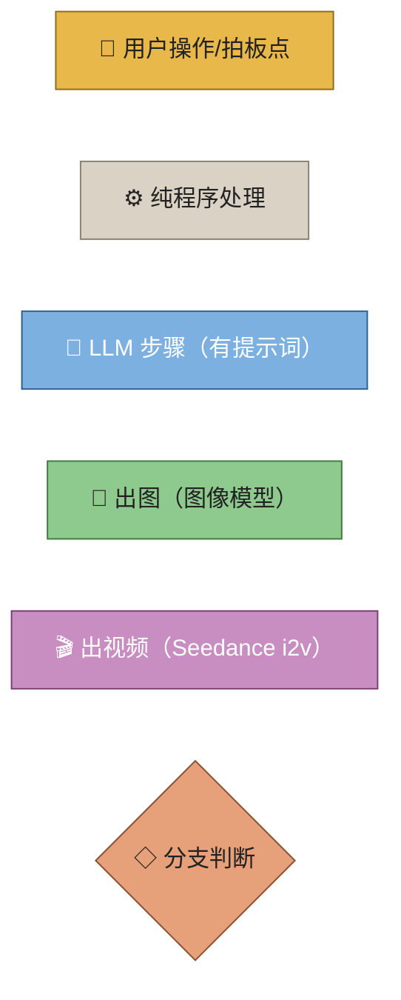
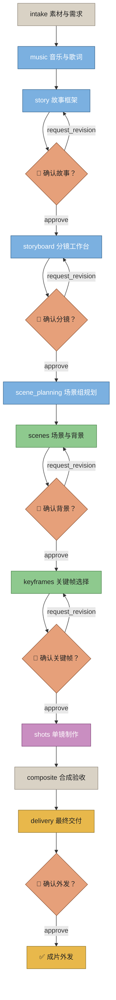
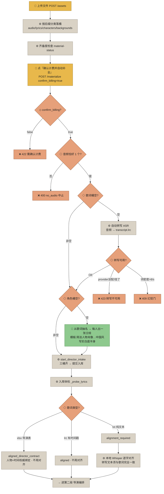
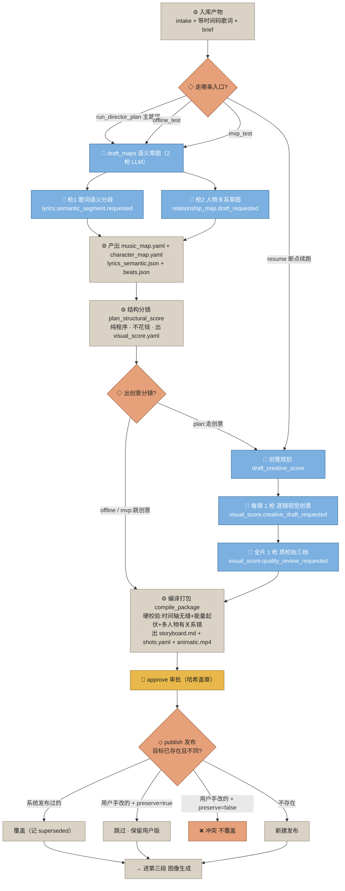
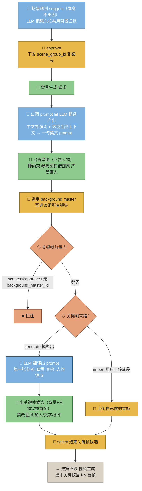
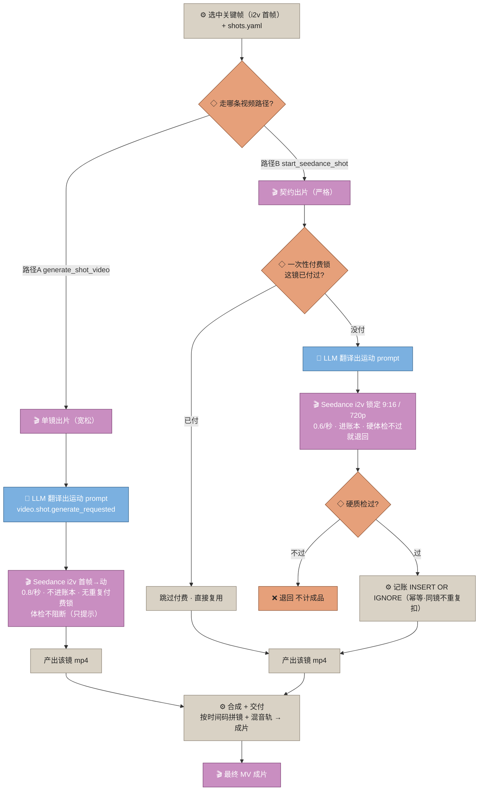

# 服务端端到端流程图(网页版制作流程）

> 说明：这是当前多租户服务端（santen/steven 在跑的那套）从**上传物料**到**成片交付**的完整流程。
> 与对话式 `paperdoll-mv-packaging` skill 是**两套独立实现**，此文只画服务端。
> 图用 Mermaid，可在 VS Code / GitHub / 预览器直接渲染。

## 节点图例

---

## 一、总览：10 个 stage 主线 + 5 个拍板点

> 备注：素材一变（换音频/歌词/加删角色图）→ 后面已确认的 stage 全部作废、状态回退到 music 重跑。
> stage 状态：`locked`（锁）→ `pending`（轮到你做）→ `awaiting_approval`（等你确认）→ `approved`。

---

## 二、第一段：物料进来 → 补齐三桶 → 入库体检

> 另有一条独立的 LLM 角色分析链路（网页多轮对话 `POST /fill/characters/analyze`）：读歌词前 8000 字，
> 让"MV 导演助手"识别人物、末尾吐 JSON。与上面自动物料化的"从 xlsx 抽名"是两条不同的路。
> 转写 provider 选择链：**先本地 faster-whisper（MVSTUDIO_WHISPER_MODEL）→ 再远端网关**，逐个试，前面失败就 fall through。

---

## 三、第二段：导演编排（语义分析 → 分镜 → 创意 → 审批发布）

> LLM 发送机制：system = 系统词+任务词拼接（尾部追加 "Return one JSON object only…"），
> temperature=0、json_object、流式；中文提示词先经翻译器翻英文再发。
> `run_director_plan` 发布用 `supersede=true, preserve_user_edits=true`（保护用户手改）；mvp 用默认 false/false。

---

## 四、第三段：图像生成（背景 / 关键帧共用出图引擎）

> 出图引擎固定 n=1（一次一张），有参考图走 images.edit、无参考图走 images.generate。
> 角色图是另一条独立链路，不走翻译，纯中文模板直发。

---

## 五、第四段：视频生成 + 成本记账

> **Seedance 只有 i2v**（必须给首帧），没有纯文生视频分支、没有负向提示词；
> 固定 `generate_audio=False`、`watermark=False`。
> **两条视频路径记账口径不一致**（历史遗留，值得留意）：
>
> | | 路径A generate_shot_video | 路径B start_seedance_shot |
> |---|---|---|
> | 单价 | 0.8/秒 | 0.6/秒 |
> | 进成本账本 | 否 | 是 |
> | 重复付费锁 | 无 | 有（一次性锁） |
> | 质检 | 非阻断（只提示） | 硬门（不过退回） |
> | 尺寸 | 跟随请求 | 锁死 9:16 / 720p |

---

## 六、三个容易踩的点（复盘用）

1. **materialize 是"入口门"不是"合成步"**：它只负责把音频/歌词/人物三个桶补齐并触发入库，
   硬前提是**必须且仅有 1 条音频**（否则 400 no_audio）；`confirm_billing=false` → 422；
   转写不可用 → 423；歌词幻觉 → 409。它不产出任何画面。
2. **两条视频路径口径不一致**（见上表）——同一个片子走 A 和走 B，扣费与质检行为不一样。
3. **出图 / 出视频的英文 prompt 都是 LLM 现翻的**：用户永远只写中文导演词，
   系统内部先过"翻译器"LLM 转英文再发给图像/视频模型；角色图是例外（纯中文模板直发）。
